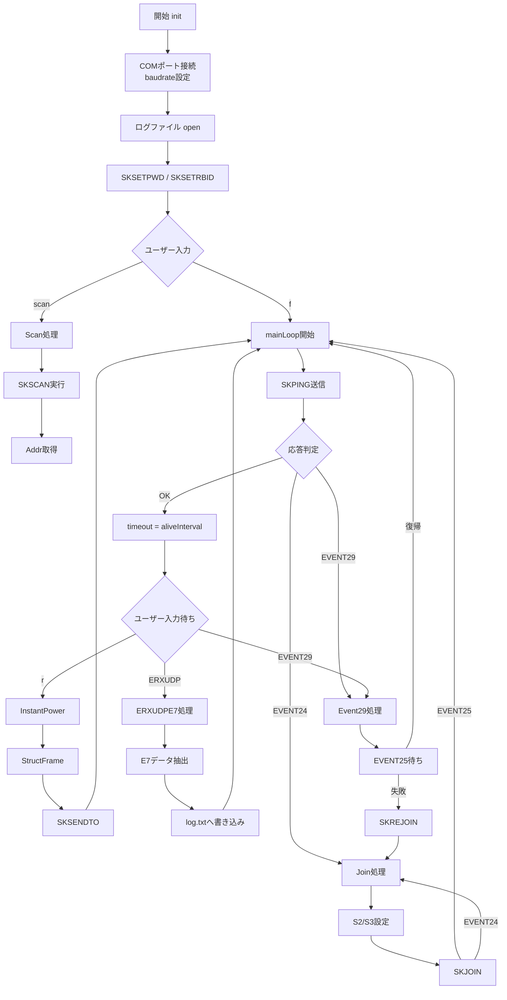

```mermaid
flowchart TD
    A[開始 init] --> B[COMポート接続<br>baudrate設定]
    B --> C[ログファイル open]
    C --> D[SKSETPWD / SKSETRBID]
    D --> E{ユーザー入力}
    E -->|scan| F[Scan処理]
    E -->|f| G[mainLoop開始]

    %% Scan
    F --> F1[SKSCAN実行]
    F1 --> F2[Addr取得]


    %% main loop
    G --> H[SKPING送信]
    H --> I{応答判定}
    I -->|OK| J[timeout = aliveInterval]
    I -->|EVENT24| K[Join処理]
    I -->|EVENT29| L[Event29処理]

    J --> M{ユーザー入力待ち}
    M -->|r| N[InstantPower]
    M -->|EVENT29| L
    M -->|ERXUDP| O[ERXUDPE7処理]

    %% Instant Power
    N --> P[StructFrame]
    P --> Q[SKSENDTO]
    Q --> G

    %% ERXUDP
    O --> O1[E7データ抽出]
    O1 --> O2[log.txtへ書き込み]
    O2 --> G

    %% Event29
    L --> L1[EVENT25待ち]
    L1 -->|復帰| G
    L1 -->|失敗| L2[SKREJOIN]
    L2 --> K

    %% Join
    K --> K1[S2/S3設定]
    K1 --> K2[SKJOIN]
    K2 -->|EVENT25| G
    K2 -->|EVENT24| K
```